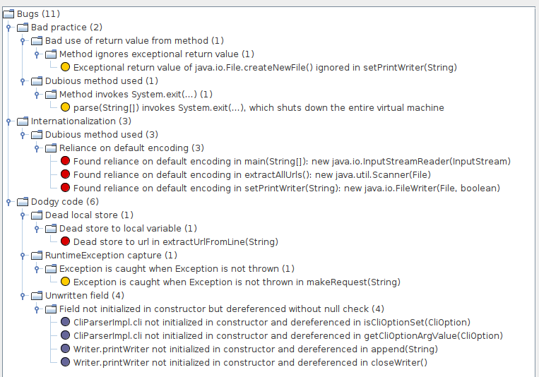
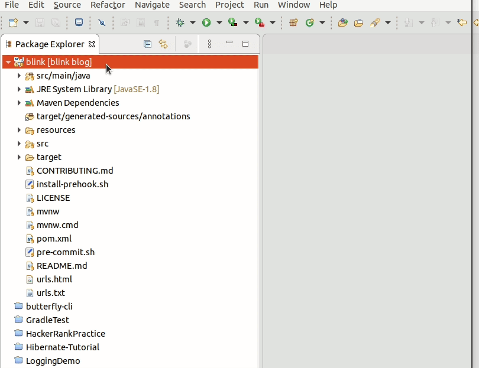

This week I have worked to add two static analysis tools in [Blink](),[Google
Java Format]() for source code formatting and [SpotBugs]() for error checking.
The process was easy and I will describe them here elaborately.

#### [Google Java Format](https://github.com/google/google-java-format)

>google-java-format is a program that reformats Java source code to comply with
>[Google Java Style](https://google.github.io/styleguide/javaguide.html)

So, basically it will format your code following Google's [coding
standard](https://google.github.io/styleguide/javaguide.html) for
Java. There is no particular reason for choosing this formatter.
I just wanted to try this one.

There are several ways to incorporate it in the project. Blink is a [Maven](https://maven.apache.org/)
project, so I used a Maven plugin, [Spotless](), to use the formatter.

#### [Spotless](https://github.com/diffplug/spotless/tree/main/plugin-maven#google-java-format)

>Spotless is a general-purpose formatting plugin. It is completely à la carte,
>but also includes powerful "batteries-included" if you opt-in.

So, in a nutshell, Spotless supports numerous language and formatting style.
Lets set it up for google-java-format using Maven.

_Pre-requisite: Maven 3.1.0 and JRE 8+._

Add the following in the pom.xml file

```xml
<build>
  <plugins>
    .
    .
    .
    <plugin>
      <groupId>com.diffplug.spotless</groupId>
      <artifactId>spotless-maven-plugin</artifactId>
      <version>2.5.0</version>
      <configuration>
        <java>
          <googleJavaFormat>
          <version>1.8</version>
          </googleJavaFormat>
          <removeUnusedImports />
        </java>
      </configuration>
    </plugin>
    .
    .
    .
  </plugins>
</build>
```

This is the most basic setup. You can add more configuration like specifying
import order, including specific files, excluding specific files, adding license
header etc. Read [here](https://github.com/diffplug/spotless/tree/main/plugin-maven#java)
to see how to add these configuration.

Alright, now that Spotless is added and configured for google-java-format, I can
run `mvn spotless:check` to check the code formatting violations and `mvn
spotless:apply` to apply the code formatting.

**Demo**

I have the following dirty code block-

```java

  public UrlStatus(String url, int status) {
        this.url = url;
            this.statusCode = status;
        if (status == 1) {
        urlCategory = UrlCategory.BAD;
        } else if (status >= 100 && status <= 299) {
        urlCategory = UrlCategory.GOOD;
        } else if (status >= 400 && status <= 499) {
                    urlCategory = urlCategory.BAD;


    }
  }
```

After I run `mvn spotless:check`, I get the following output in my terminal.


The lines with "-" sign violated the formatting rule and the lines with "+" sign
are the expected formatting. To fix the formatting, I run `mvn spotless:apply`.
The output is following-

```java
  public UrlStatus(String url, int status) {
    this.url = url;
    this.statusCode = status;
    if (status == 1) {
      urlCategory = UrlCategory.BAD;
    } else if (status >= 100 && status <= 299) {
      urlCategory = UrlCategory.GOOD;
    } else if (status >= 400 && status <= 499) {
      urlCategory = urlCategory.BAD;
    }
  }

```

**Eclipse Integration**

I wanted to integrate google-java-format with Eclipse following the instructions
[here](https://github.com/google/google-java-format#eclipse). However, it did
not work and I did not investigate why. Maybe I will do later. I followed an
alternative method described in this [blog](http://www.practicesofmastery.com/post/eclipse-google-java-style-guide/).

#### [SpotBugs](https://spotbugs.github.io/)

>SpotBugs is a program which uses static analysis to look for bugs in Java code.
>SpotBugs checks for more than 400 bug patterns.  SpotBugs requires JRE (or JDK)
>1.8.0 or later to run. However, it can analyze programs compiled for any
>version of Java, from 1.0 to 1.9.

Adding SpotBugs to Blink was easy. I just added the following to my pom.xml.

```xml
<build>
  <plugins>
      .
      .
      .
      <plugin>
          <groupId>com.github.spotbugs</groupId>
          <artifactId>spotbugs-maven-plugin</artifactId>
          <version>4.1.4</version>
          <configuration>
              <effort>Max</effort>
              <threshold>Low</threshold>
              <xmlOutput>true</xmlOutput>
          </configuration>
          <executions>
              <execution>
                  <goals>
                      <goal>check</goal>
                  </goals>
              </execution>
          </executions>
      </plugin>
            .
            .
            .
    </plugins>
</build>
```

To read more about other configuration read [here](https://spotbugs.readthedocs.io/en/latest/index.html).
Now, to scan files for bugs, run `mvn spotbugs:check`. This will report all bugs
in the console. To view the bugs in GUI mode, run `mvn spotbugs:gui`. This will
open a GUI with list of bugs, bug description, line of buggy code.When I ran the
SpotBugs on Blink, I got following bugs-



Once I fix those bugs, the maven build passes and everything is fine.

**Eclipse Integration**

Eclipse plugin for SpotBugs can be found in the Eclipse [marketplace](https://marketplace.eclipse.org/content/spotbugs-eclipse-plugin).
Once the plugin is installed, right click on the project and you will see
SpotBugs in the menu.



You can read [here](https://spotbugs.readthedocs.io/en/latest/eclipse.html#using-the-spotbugs-eclipse-plugin) for
more information about setup.

That's the progress so far. Blink is getting better gradually. Next I will write
about adding a [Git
Hook](https://git-scm.com/book/en/v2/Customizing-Git-Git-Hooks) to my project to
automate these tasks and setup [GitHub Actions](https://github.com/features/actions).

