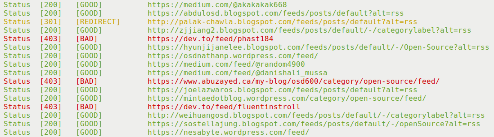

The inner workings of the application is very simple. It reads
every line of the given file and extracts all the HTTP/HTTPS scheme URLs. It
then makes HTTP/HTTPS header request to the URL and based on the status of the
request it determines whether it is a bad URL or a good URL.
The application currently supports color output in the Linux terminal.

#### Available Features

- Running the tool with no arguments prints a help message to guide user how to
  use it
- The application can take a file name in current directory or a file path and
  processes the file to find the broken links
- It processes links with HTTP/HTTPS scheme
- Prints "GOOD"/"BAD" status based on HTTP response. See the response code at
- Prints "REDIRECT", if an URL was redirected
  [https://developer.mozilla.org/en-US/docs/Web/HTTP/Status](https://developer.mozilla.org/en-US/docs/Web/HTTP/Status)
- Color output of the result
- Save the result in a file

#### How to Use the Application

Check out this repository [https://github.com/badalsarkar/Blink](https://github.com/badalsarkar/Blink).

#### My Learning

The project was interesting and I learned several new things. I have used Java
to write the application and Maven as the build tool.

#### Maven Build Tool

[Maven](https://maven.apache.org/index.html) is a popular build tool that
automates the build process of application. I have used Maven for the first time
in my project. The learning curve was steep. But after I leaned some basic
commands, it was easy to compile and test the application.

#### Color Output in Terminal

Color output in terminal was new to me. I used an open source library for this
purpose. The library supports Java +8, Linux, macOS, Windows 10. This was
perfect for color outputting text across platforms. Here is the [GitHub Repo](https://github.com/dialex/JColor) and
here is the [Maven Repo](https://mvnrepository.com/artifact/com.diogonunes/JColor).

#### Open Source Licensing

I have added MIT License to my project. I have yet to learn details about
different licenses.

#### What's Next

The application has lots of room to improve. Currently, I am making the HTTP
request asynchronously using the [HttpURLConnection](https://docs.oracle.com/javase/8/docs/api/java/net/HttpURLConnection.html)class.
But, I have found a new library for doing that in more efficient way. It is
called async-http-client. See their github repository here [https://github.com/AsyncHttpClient/async-http-client](https://github.com/AsyncHttpClient/async-http-client).
Moreover, the project is open to any contribution.
