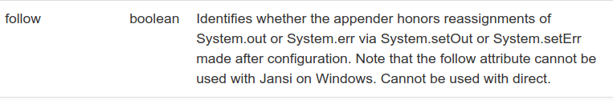
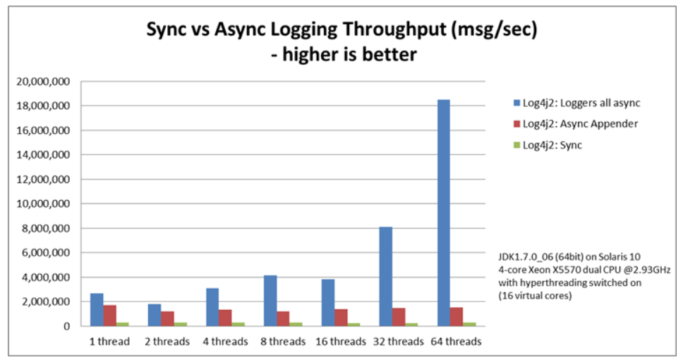

I have been trying to fix a bug in my code which I was writing to implement a
new feature in PayPal/Butterfly. I have written about the bug [here](https://badalsarkar.ca/blog-opensource/new-feature-butterfly/).

I have finally uncovered the cause of the problem and it was a silly
one. To quickly recap, I was implementing Log4j2 as logging framework and there
I was using `System.setOut()` method to assign File object as standard output.
So, when I write `System.out.println()`, in stead of printing to console, it
will print in the file. The problem was that the output was not going to the
file. Log4j2 has a specific attribute for `ConsoleAppender` to activate
reassignment of standard output. It is called `follow`. Following screenshot
taken from documentation.



<br>
I never noticed it in the documentation and spent many hours trying different
things. After the fix the code looks like below-

```xml
<Console name="CONSOLE" target="SYSTEM_OUT" follow="true">
    <PatternLayout pattern="%msg%n" />
</Console>
```

Now, all the tests are passing.

### Configure Loggers for Asynchronous Logging

Butterfly wanted to use Log4j2 because of its [asynchronous
logging](https://logging.apache.org/log4j/2.x/manual/async.html) feature. The
performance benefit of asynchronous logging is massive. Following graph gives
an idea.



Image taken from [https://logging.apache.org/log4j/2.x/manual/async.html](https://logging.apache.org/log4j/2.x/manual/async.html)

So, next I needed to configure the loggers for asynchronous logging. I followed
the [documentation](https://logging.apache.org/log4j/2.x/manual/async.html) and
my configuration looks like below-

```xml

<?xml version="1.0" encoding="UTF-8"?>
<configuration>
  <Appenders>
    <Console name="CONSOLE" target="SYSTEM_OUT" follow="true">
      <PatternLayout pattern="%msg%n" />
    </Console>
    <Routing name="Routing">
      <Routes pattern="$${sys:logFile}">
        <Route>
          <RandomAccessFile name="File" fileName="${sys:logFile}" immediateFlush="false">
            <PatternLayout>
              <pattern>[%d{HH:mm:ss.SSS}] [%-4level] %msg%n</pattern>
            </PatternLayout>
          </RandomAccessFile>
        </Route>
      </Routes>
    </Routing>
  </Appenders>

  <Loggers>
    <AsyncLogger name="com.paypal.butterfly.cli" level="INFO">
      <AppenderRef ref="CONSOLE" />
    </AsyncLogger>
    <AsyncRoot level="ERROR">
      <AppenderRef ref="Routing" />
    </AsyncRoot>
  </Loggers>
</configuration>

```

I used `<AsyncRoot>` and  `<AsyncLogger>` to declare the loggers as asynchronous.
Log4j2 accepts a system property `log4j2.contextSelector=org.apache.logging.log4j.core.async.AsyncLoggerContextSelector`
to make all the loggers asynchronous. For the asynchronous loggers to work, I had
to add a new dependency [LMAX Disruptor](https://github.com/LMAX-Exchange/disruptor).
This one is high performance inter-thread messaging library which uses lock-free
inter-thread communication instead of queues. I need to know more about it.
So, that was all for configuring async logger. Time to test.

When I ran the tests, four test cases were failing. Not again!!

This time though, I figured it out quickly. As the loggers were asynchronous and
the test cases were written for testing synchronous code, they failed. I don't
know how to write test for asynchronous code using
[TestNG](https://testng.org/doc/), the testing framework Butterfly is
using. Using `Thread.sleep()` is not going to work as there were integration
tests and I can't tell for sure where to put `Thread.sleep()`.  Moreover, it is
not a good practice for testing asynchronous code. After googling for a while, I
found that often for testing purpose a separate configuration is used, a
synchronous configuration. So, I decided to create a separate configuration file
named `log4j2-test.xml` where all the loggers are synchronous. The file name is
very specific as Log4j2 looks for file with exact name and uses this
configuration for testing purpose. The file needs to be on the classpath. Run
the test again and all green.

Next, I organized my commits using `git rebase` and created a [pull
request](https://github.com/paypal/butterfly/pull/367). All checks of TravisCI
passed. Now waiting for the maintainer to review my code and do any modification
he asks.


