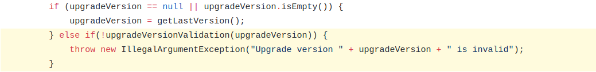

I have been working on an
[issue](https://github.com/paypal/butterfly/issues/214) in an open source
project called [Butterfly](https://github.com/paypal/butterfly) maintained by PayPal.

> Butterfly is an application code transformation tool, and commonly it is used
> to perform automated application migrations, upgrades and source code and
> configuration changes.

One of the features of Butterfly is that an application can be upgraded to the
highest version currently available or to any version specified by end user. If
a target version is specified by user, it must be validated to make sure that
the version exists, it is not older than current version and it is not the same
as current version. An exception is thrown if any of the checks fails.

The issue is that the current exception message is very generic and it needs to
be updated based on three different checks mentioned above. More specifically
the message should be as following-

- The upgrade version doesn't exist
- The upgrade version is older than the current version
- The upgrade version is same as current version

So, I made the following changes which checks if the target version is the same
as the current version and if the target version is older than the current
version.

To check if target version is older, I have used a library function. String
comparison would not work here. I have used
[Gradle-Core](https://mvnrepository.com/artifact/org.gradle/gradle-core/6.1.1)
library's [`VersionNumber`](https://github.com/gradle/gradle/blob/master/subprojects/core/src/main/java/org/gradle/util/VersionNumber.java)
class.

I have also added the following test cases-

Once everything was done, I created my [PR](https://github.com/paypal/butterfly/pull/362).

#### Change Request from Maintainer

The maintainer made some change requests to my [PR](https://github.com/paypal/butterfly/pull/362).
One of the change requests was regarding the library.
[Gradle-Core](https://mvnrepository.com/artifact/org.gradle/gradle-core/6.1.1)
is not a heavy library but it has many [transitive
dependencies](https://en.wikipedia.org/wiki/Transitive_dependency).
The maintainer suggested to look for a different solution as he doesn't want to
add those transitive dependencies as it will increase the memory footprint of
the application. I responded saying that I could implement the function or I can
use another [library](https://github.com/G00fY2/version-compare) that I found
that doesn't have any dependencies. He suggested to use the library. I am in the
process of making necessary change and once done, I will update my PR.
