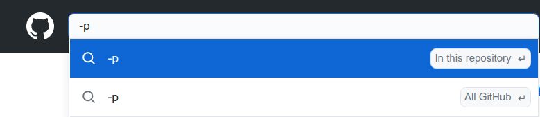
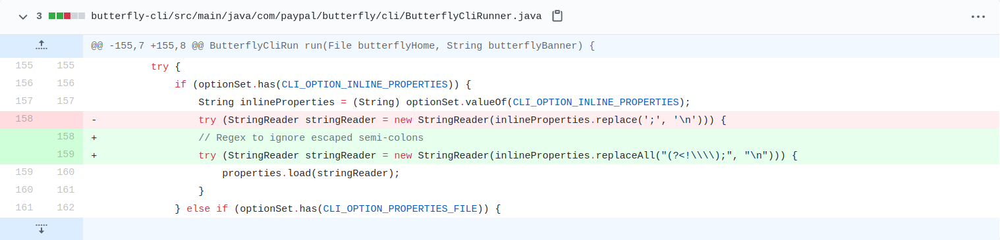

This is my third PR for release 0.2. The PR was for a bug fix in the [Butterfly](https://github.com/paypal/butterfly) project maintained by PayPal.

> Butterfly is an application code transformation tool, and commonly it is used
> to perform automated application migrations, upgrades and source code and
> configuration changes.

The command-line interface of the application had a
[bug](https://github.com/paypal/butterfly/issues/360). The parsing of option
`-p` needed to be changed to allow some escaped characters. I reached out to the
maintainer and he assigned the issue to me and I started my research on the code
base.

This project had a contribution [guideline](https://github.com/paypal/butterfly/blob/master/docs/CONTRIBUTING.md).
It is very important to look for any contribution guideline and follow before
starting any work. This project wanted the contributors to checkout the
`develop` branch. Which basically means that I should do my work based on the
work done in `develop` branch. Also, they wanted that the test coverage doesn't
drop and the pull request to be created to the `develop` branch not `master`.
They also wanted the commit message in a certain way. Again, this is super
important to follow the guideline.

It took me a while to find out where exactly I need to make change. I used
GitHub's search tool to find where the option `-p` have been used in the
code base.

The search gave a all the files where the `-p` option has been used.
Once I found the appropriate file, I made a small change. The change was not huge.

Now, I needed to add some test cases. This my first time writing test cases in a
Java project. Butterfly used [testng](https://testng.org/doc/) as testing
framework. I added three [test
cases](https://github.com/paypal/butterfly/blob/develop/butterfly-cli/src/test/java/com/paypal/butterfly/cli/ButterflyCliRunnerTest.java)
to check my work. Once everything was working as expected, I committed my work
and opened a [pull request](https://github.com/paypal/butterfly/pull/361/commits/ffa590358e2b2bf09a3f7079549f1191b5f673a6#diff-583aba2591cb4afb18495238207966eede2742c24160b1b1e963cce61fc31445).
