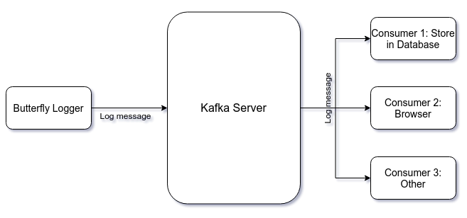

As part of [release
0.4](https://github.com/Seneca-CDOT/topics-in-open-source-2020/wiki/release-0.4),
I am working on implementing a feature in
[PayPal/Butterfly](https://github.com/paypal/butterfly) project. The feature is
following-


What this means is that the logging framework of Butterfly will use
[Kafka](http://kafka.apache.org/) to do
some processing on the log messages. To understand this lets first see what is
Kafka.

### Apache Kafka

> Apache Kafka is an open-source distributed event streaming platform used by
> thousands of companies for high-performance data pipelines, streaming
> analytics, data integration, and mission-critical applications.

As it is mentioned above, [Kafka](http://kafka.apache.org/) is an event
streaming platform. Event streaming
means capturing data from events and storing those durably for further
processing. In simple term, Kafka consists of servers and clients. Clients send
and receive data to/from server. The client that sends data to the server is
called producer and the client that retrieves data from server is called
consumer. Producers and consumers are fully decoupled. Producers doesn't know
who is going to consume the data. Again produced data can be consumed by many
consumers. You can read more about Kafka [here](http://kafka.apache.org/intro).

### Butterfly and Kafka

The following diagram illustrates how Butterfly will use Kafka.



As the above diagram shows, the loggers will send log messages to the Kafka
server and those messages will be consumed by different consumers like storing
to database, sending to browser etc. To understand how logging is working in
Butterfly you can read
[this](https://badalsarkar.ca/blog-opensource/opensource/new-feature-butterfly/)
post.

There are basically three tasks to implement this architecture.

- Configure Kafka server
- Configure producer
- Configure consumers

Configuring consumers is not part of this feature. So, I need to do first two
tasks.

### Configuring producer

Configuring producer is easier among the two tasks because
[Log4j2](https://logging.apache.org/log4j/2.x/), logging framework
used by Butterfly, [provides an appender that will send log messages to Kafka
server](https://logging.apache.org/log4j/2.x/manual/appenders.html#KafkaAppender).
I just need to add that appender to the Log4j2 configuration file. So, I
added the following code to the configuration file-

```xml
<Appenders>
  <Kafka name="Kafka" topic="log-message">
    <PatternLayout pattern="[%d{HH:mm:ss.SSS}] [%-4level] %msg%n" />
      <Property name="bootstrap.servers">{butterflyserver:port}</Property>
  </Kafka>
</Appenders>

<Root level="ERROR">
  <AppenderRef ref="FILE" />
  <AppenderRef ref="Kafka" />
</Root>
```

This configuration is simple. The appender is an instance [KafkaAppender
class](https://logging.apache.org/log4j/2.x/log4j-core/apidocs/org/apache/logging/log4j/core/appender/mom/kafka/KafkaAppender.html).
It connects to the Kafka server using the property `bootstrap.servers`. Once the
server is implemented this value will be populated. Next this appender is
attached to the root logger. Now, every time root logger logs a message, it will
be picked up by Kafka appender and sent to the server.

Next step is to configure the server. I will write about it next week.
