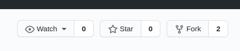

I made my first [pull request (PR)](https://docs.github.com/en/free-pro-team@latest/github/collaborating-with-issues-and-pull-requests/about-pull-requests)
a few days ago, in one of classmate's
[repository (repo)](https://github.com/VietnameZe/insane-cli). It was for
implementing a feature in his project. He accepted my PR and merged my change in
his project.
It felt amazing to be able to collaborate with someone and make a project better.

#### The Process

In a nutshell, if you make any changes in any repo in GitHub, you create a PR to
tell others about the changes. Before my first PR, I always wondered about the
process. How should I start working on a project and request for my changes to
be merged to the main project? The process is really simple.

**Step 1:**

Read the instructions first. Many projects will have instructions on how to
contribute to the project. Follow those instructions while making any change.
If there is no instructions, you can reach out to the project owner or repo
maintainer and ask your questions. In general, for changes in the code, follow
the same pattern as in the original code.

**Step 2:**

Fork the repo by clicking the Fork button.

Forking basically means copying the repo to your own account. The original repo
that you forked is called `upstream` and your copy of the repo is called
`origin`. You can make any changes in the origin and push it without affecting
the `upstream`. Usually you will have only read access to the `upstream`.

**step 3:**

Clone the repo to your computer.

**Step 4:**

This is very important step. Before you make any changes in the project, you
should create a branch so that your changes are isolated from the `main` branch.
Give a descriptive name to the branch so that it tells what the branch is for.
Checkout to the branch and run all the tests. This is super important. Before,
you start working, you should make sure that the project is working as
expected. Not all the projects will have test cases. In that case, just
try running the application and see if it is working.

**Step 5:**

Make your changes. Again, follow the instructions if any or maintain consistency
with existing code base.

**Step 6:**

Test the application with your changes. If there are existing tests, you can add
test case for your change. Run all the tests and make sure all of them passes.

**Step 7:**

Commit your code with good commit message. I use a template for writing my
commit messages. [Here](https://gist.github.com/lisawolderiksen/a7b99d94c92c6671181611be1641c733)
is a template.

**Step 8:**

Once your are done with your work, you can push the changes to your origin with
the command `git push origin {your branch name}`.

**Step 9:**

Open a pull request. You can open pull request from `origin` or `upstream`. Be
sure to put all relevant information in the pull request. Once the project owner
reviews your code they might merge it with `main` branch or provide you feedback
if they want to change something if your work.

Throughout the entire process, be sure to communicate with the project
owner if you have any questions.

#### The Work

Following the above steps, I have made my first [PR](https://github.com/VietnameZe/insane-cli/pull/7) to [Huy
Nguyen's](https://github.com/VietnameZe) project called
[insane-cli](https://github.com/VietnameZe/insane-cli). He wrote this
application which checks whether an URL is valid or not. This was done as part
of the OSD600 [course work](https://github.com/Seneca-CDOT/topics-in-open-source-2020/wiki/release-0.1).
I wanted to implement a feature which will search a webpage in the [WayBack
Machine](https://archive.org/web/). I sent Nguyen a message stating how I would
like to implement the feature. Once he agreed, I followed the above mentioned
steps to implement the feature and create a pull request. Once Nguyen received
my pull request, he reviewed it and found some issues. After that, me and Nguyen
worked together to resolve the issue and finally he merged my change to the
`main` branch.

#### My Learning

Going through this process, gave me confidence in working on someone else's
project. This is great as it broke the barrier and now I am looking forward to
working on different open source projects.
