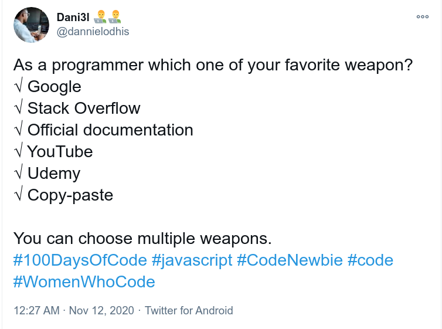

I have started contributing to open source projects roughly 4 moths ago. This
journey started because of OSD600 course of Seneca College. This 4 months were
the most exciting of my entire college life. I have contributed to a few
projects including a [project maintained by
PayPal](https://github.com/paypal/butterfly). I have learned many new skills. In
this blog I am going to talk about some of the benefits of contributing to open
source projects. You may also achieve these benefits by working on open source
projects. Also I am going to share my thoughts on deciding on which project to
work.

### How open source projects helped me

4 months ago I had no clue how to use Git and GitHub properly let alone
contributing to a project. Today, I have the confidence that I can work on
fixing complicated bugs, implementing a new features, navigating large code
base, working with other- more experienced developers and many more.

#### Experience

I think this one is the most crucial for new developers. All jobs ask for some
sort of experience in development and new developers usually struggles to get
experience. Of course, if I don't get a job how do I get experience. We do
personal projects to showcase our skills. This is great. Open source projects
can help to get development experience. There are tons of projects and
tons of things to work on. Big companies also have open source projects. If you
work on any of these projects, you can write that in your resume which will
definitely add value.

#### Understanding the code

When we build our own application, we are the one who decide on the code
structure. If there is a bug, we can find it out and solve it comparatively
easily. Because it is our code. But in job we are not going to write all the
codes ourselves. We will be working with code written by others, probably, maintain
already written code which is in production. To fix a bug or implement a new
feature in existing code is tough. If the code base is unknown and large, it is
tougher.  Navigating the code base, understanding how different components are
interacting with one another is a crucial skill. You need to develop this in
order to make any change confidently, in the production code base. A college
student don't get the chance to work on projects like this. You can master this
skill by working on open source projects. Big projects, used by many people, are
out there. You can get the code in your computer, look at the code base, work
with it. You can learn how big companies organize their projects, how they write
codes.

#### Learning new tools, technologies and concepts

There are so many tools and technologies out there. Which one should I learn?
This question used to pop up in my mind now and then. I was very confused.
Now, I think that apart from fundamental stuffs, you learn what you need for your
     work. It has happened to me so many times that I have learned something new
     then I have forgotten it after one month because I did not use it. Or the
     learning process was hard because there was no application of that
     knowledge. Working in open source projects helps in this respects too. So
     far I have learned about [Java modular
     system](https://www.oracle.com/corporate/features/understanding-java-9-modules.html),
     [Gradle](https://docs.gradle.org/current/userguide/userguide.html),
     [Maven](https://maven.apache.org/what-is-maven.html), Git, GitHub, GitHub
     Actions, [Log4j2](https://logging.apache.org/log4j/2.x/),
     [Logback](http://logback.qos.ch/), [SLF4J](http://www.slf4j.org/),
     [Kafka](https://kafka.apache.org/intro),
     [Junit](https://junit.org/junit5/docs/current/user-guide/) to name a few.
     There are many other smaller things. This will add up. The best part is
     that I can retain my knowledge because I have learned it as part of my work
     and I have used it. I have learned by doing.

#### Reading documentation

I have seen this twitter last month-

We all have our favorite weapon. I feel that for newbie developers, reading
official documentations is the least favorite weapon. It is intimidating to read
the documentations. But this is just for a few times. If you read the
documentations you get a clear picture of how that specific thing works. For
example, when I read someone's answer about how to use an unknown function in
Java, may be I get how I should write it in my code. But when I look into the
documentations, I get whole lot of information like whether the function throws
an exception which I need to  handle. When you work on open source projects,
    often you deal with something new, like a weired bug or using a new
    library. In those cases, you will find yourself reading the documentations
    very often. After a few times, official documentations will be your favorite
    weapon. Of course, not all projects have good documentations. I have
    struggled with this several times.

#### Your code reviewed by other developers

The code you contribute to open source projects are reviewed by other
developers. This is a great opportunity to learn from other, more experienced
developers. Don't get upset when you see a review request on your code. This is
a learning opportunity. This also helps improve communication skill- getting
your ideas through.

#### Confidence build up

As newbie developers, we often suffer from lack of confidence. At least that is what
happened to me. I used to think what would it be like to work with production
code. Can I do it? What if I break something? How do I know for sure that I have
not broken something? I also didn't have the courage to approach an open source
project maintainer and say that I would like to contribute. Working in a few
projects have boosted my confidence. Now, I have the confidence to handle
complicated bugs and implementing new features. It may take time but I will get
to the solution.

#### Networking

The most important factor to get a job is networking as we know 80% jobs are
hidden. We network in different platforms and forms. To me the best person to
talk about my work is the one who I have worked with. Others will also put more
weight on that person's word. In open source projects, you are working with
other developers who are seeing your work, evaluating your work. When a
developer talks good about your skill, what do you think it will do? You might
get an OFFER.

### How should I choose which project to work in

This depends on what you want to achieve. I will share my decision criteria so
it may give some points to consider. I decided to improve my Java skill.
So, I looked for Java projects. Among many I decided to work on projects
maintained by large companies as this will look good on my resume. I did not
choose projects where there are hundreds of developers. This is because I
was just starting out. There is no reason why you should not contribute to
projects where there are many developers. Next, I decided to focus on one or two
projects so that I can make big contribution like implementing new feature. To
me it seemed better than making contributions to many projects.
Once I have enough confidence, I will go out to pick another project and put
significant contribution. Don't get me wrong, in open source all contributions
count. This was just my preference.

This is my achievement and learning so far from open source projects. I am
really loving it. I can see myself contributing to more projects in future and
blog about it. Stay tuned.
