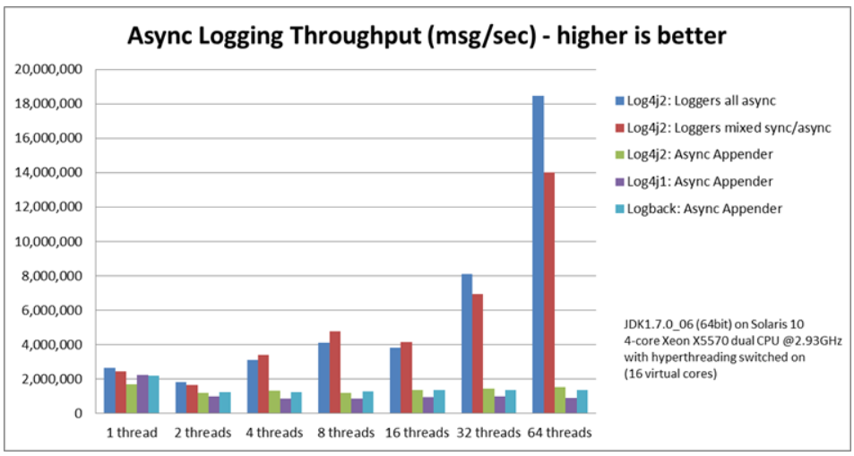
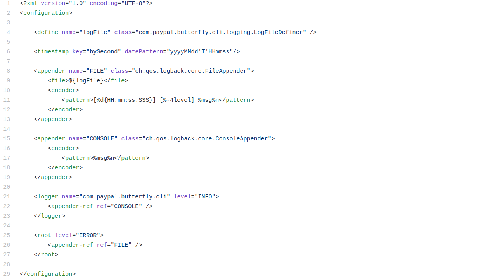

I have been working on [Paypal/Butterfly](https://github.com/paypal/butterfly)
project for about a month. Previously I have fixed [two
bugs](https://github.com/pulls?q=is%3Apr+author%3Abadalsarkar+archived%3Afalse+is%3Aclosed+repo%3Apaypal%2Fbutterfly)
and this time I am implementing a [new
feature](https://github.com/paypal/butterfly/issues/314). The task is to replace
existing logging framework, [Logback](http://logback.qos.ch/), with
[Log4j2](https://logging.apache.org/log4j/2.x/index.html).

### Logging frameworks

Logging in Java requires using a [logging
framework](https://en.wikipedia.org/wiki/Java_logging_framework). There are many
logging frameworks to choose from. Java provides a built in framework in
`java.util.logging` package. There are also third party logging frameworks like
Log4j, Logback, tinylog, Apache Commons Logging, SLF4J.

All these frameworks except SLF4J provide fundamental logging functionality with
differences in features and performance. SLF4J is a facade for various logging
frameworks.  It provides interfaces which various frameworks implement and thus
enables end users to use desired framework during deployment time. Programming
against SLF4J interfaces also means that end users can switch to a different
logging framework without changing all the codes for logging. An example
will make it clear.

```java

import org.slf4j.Logger;
import org.slf4j.LoggerFactory;

public class HelloWorld {
  public static void main(String[] args) {
    Logger logger = LoggerFactory.getLogger(HelloWorld.class);
    logger.info("Hello World");
  }
}

```

The above code example from SLF4J website, shows that we are logging an info
"Hello World" using SLF4J API [`LoggerFactory`](http://www.slf4j.org/apidocs/org/slf4j/LoggerFactory.html).
Behind the scene, we can use
any of the above mentioned frameworks which provides implementation for SLF4J
interfaces. Lets say we want to use Logback. All we need to do is provide the
configuration file `logback.xml`. Again, if we decide to switch from Logback to
Log4j2, all we need to do is replace configuration of Logback with Log4j2. Our
code above doesn't need to change. So, using SLF4J API instead of framework
specific API provides huge flexibility.

### Why Butterfly wants to use Log4j2

> Apache Log4j2 is an upgrade to Log4j that provides significant improvements
> over its predecessor, Log4j 1.x, and provides many of the improvements
> available in Logback while fixing some inherent problems in Logback’s
> architecture.

Log4j2 offers many improvements including better performance. Its asynchronous
logger's performance is impressive. The following comparision, of different
logging library performance gives some idea.


source: [https://logging.apache.org/log4j/2.x/performance.html](https://logging.apache.org/log4j/2.x/performance.html)

You can also read about performance [here](https://logging.apache.org/log4j/2.x/performance.html).
Butterfly wants to take advantage of the improved performance specially the fast
asynchronous logging.

### How Butterfly is using Logback

Butterfly is using SLF4J API with Logback implementation. The Logback
configuration file `logback.xml` has the following contents.



Lets see what these configurations mean.

- At line 4, a property named `logFile` is defined. The value of `logFile` is
calculated dynamically at runtime by
`LogFileDefiner` class.

- At line 6, a pattern for timestamp is defined.

- Line 8 to 13 defines an `Appender` named `FILE` which is an instance of
[`FileAppender`](http://logback.qos.ch/manual/appenders.html#FileAppender) class
of Logback. The task of an `Appender` is to take a logging
event and process it. So, the `FILE` appender in this case, processes an event
by saving it in `logFile`(line 9) using the pattern specified in line 11.

- Line 15 to 19 defines another `Appender` named `CONSOLE`, an instance of
[`ConsoleAppender`](http://logback.qos.ch/manual/appenders.html#ConsoleAppender)
class of Logback, which processes a logging event by printing
to console using the specified pattern.

- Line 21 to 23 defines a
[`Logger`](http://logback.qos.ch/apidocs/ch/qos/logback/classic/Logger.html)
named `com.paypal.butterfly.cli` with level `INFO`. A logger is an object which
is used by the application to log an event. An event can be marked by
different levels like `INFO`,`ERROR`,`DEBUG`,`TRACE` etc. When a logger receives
an event from the application it forwards that to the appenders registered with it.
In this example, there is one registered appender- `CONSOLE` configured in line
15-19. So, when the application passes an event to `com.paypal.butterfly.cli`
logger, it will print it to the console.

- Line 25 to 27 defines a `root` logger with level `ERROR` and it has one
registered appender- `FILE`. So, this logger will store log events to the
`logFile`. Notice `root` logger has no name.

In addition to the above configuration file, Butterfly has two other
configuration files- LogFileDefiner.java and LogbackLogConfigurator.java.

`LogFileDefiner` class provides functionality to define a log file at runtime.
This log file is the file used in logback.xml line 4. You can check the full
code
[here](https://gist.github.com/badalsarkar/8d2dab5f4fda510d1820e046b1aaa688).
`LogFileDefiner` class implements `PropertyDefiner` interface of Logback. This
interface provides an abstract function `public String getPropertyValue()` which
loads the value of `logFile` defined at line 4.

LogbackLogConfigurator.java defines several methods to change some Logback
configurations at runtime such as changing log level and changing root logger's
appender to file. You can take a look at the code [here](https://gist.github.com/badalsarkar/dbf8371bb4059f714175852a43305b14).


### How I implemented Log4j2

Log4j2 also provides [implementation for SLF4J API](https://logging.apache.org/log4j/2.x/log4j-slf4j-impl/apidocs/index.html).
Therefore, the work is mainly related to configuration files and test files.
I planned the work in 3 phases-

1. Add Log4j2
2. Add tests for new implementation and modify existing tests
3. Remove Logback and related tests

**Phase 1: Add Log4j2**

Butterfly uses [Gradle]() as build tool. I added the following dependencies in
the `build.gradle` file.

`gist:badalsarkar/ca176a0335131a092618cb9066fc3fee#build.gradle?lines=1-9,13`

Next I added the following configuration file named `log4j2.xml`. Note, there is
a bug at line 5. I talked about it later in the blog.

`gist:badalsarkar/ca176a0335131a092618cb9066fc3fee#log4j2.xml`

The concept behind this configuration file is similar to the one described
above for Logback. In a nutshell, the configuration is doing the following-

- Define a console appender and routing appender [line 3 to 19]
- Define two asynchronous loggers- `com.paypal.butterfly.cli` and `root`

[Routing appender](https://logging.apache.org/log4j/2.x/manual/appenders.html#RoutingAppender) at line 8
needs some explanation. The root logger at line 25 uses routing appender to store
log events to the `logFile`. The application requirement is to set the log file
dynamically at runtime. It was easy to do so in Logback as we have seen in `logback.xml`.
In Log4j2, I could not find a way to update the `logFile` at runtime. So, I
wrapped the `RandomAccessFile` (faster than `File`) appender with `Routing` appender.

This appender can have multiple routes, and a route is selected by matching the
`pattern` attribute, in our case at line 9. A route basically determines how a log
event will be processed by using other appenders e.g. console, file etc. In our
case there is only one route which process a log event using `RandomAccessFile`
appender. So, when the root logger passes a log event to routing appender, it
forwards the event to the RandomAccessFile appender which gets the log file name
by evaluating the expression `${sys:logFile}` and store the log in the file. How
is this expression evaluated?

In Log4j2, this expression is used for property lookup. [There are several lookup options
to choose from](https://logging.apache.org/log4j/2.x/manual/lookups.html).  This
particular lookup is done in system property. The application will store the
name of the log file in the system property called `logFile`. Then
`RandomAccessFile` appender can access that system property to get the file
name.

Now, that Log4j2 is configured, there are two other
configuration files- `LogFileDefiner.java` and `LogbackLogConfigurator.java`.
I need to define new configuration to replace those files.

**LogFileDefiner**

The main function of `LogFileDefiner` class is to expose methods to manipulate 
log file name like setting log file name, getting file name etc. These are
simple getter and setter methods. In the previous section we have seen that we
need to store the log file name to system property named `logFile`. This done by
the following function-

`gist:badalsarkar/ca176a0335131a092618cb9066fc3fee#LogFileDefiner.java?lines=35-37`
<code data-gist-id="ca176a0335131a092618cb9066fc3fee"
data-gist-file="LogFileDefiner.java" data-gist-line="35-37"></code>

Then I am calling this function from the `main` method. You can take a look at
the full code
[here](https://gist.github.com/badalsarkar/ca176a0335131a092618cb9066fc3fee#file-logfiledefiner-java).

**Log4j2LogConfigurator**

This class exposes methods to change some logging configurations at runtime. I
have kept the function signature same as before but changed the implementation.
To give an example, the `root` logger uses `RandomAccessFile` as appender. The
application has a requirement to attach `ConsoleAppender` to root logger at
runtime. It is done by the following method-

`gist:badalsarkar/ca176a0335131a092618cb9066fc3fee#Log4j2LogConfigurator.java?lines=38-51`

The above method, creates a console appender [line 42-44], removes existing
appender from root logger[line 46] and attach newly created logger [line 46-47].
To understand more about dynamic configuration change, you can read about the
architecture of Log4j2 [here](https://logging.apache.org/log4j/2.x/manual/architecture.html).

At this point, the phase 1 is complete.

**Phase 2: Add Tests**

I need to add test for `Log4j2LogConfigurator` class. There were test cases for
the previous configuration `LogbackLogConfigurator`. I re-implemented those
tests for Log4j2. The following test case is for the method
`setVerboseMode(boolean verboseMode)` described above.

`gist:badalsarkar/ca176a0335131a092618cb9066fc3fee#Log4j2LogConfiguratorTest.java?lines=29-39`

You can see all test cases [here](https://gist.github.com/badalsarkar/ca176a0335131a092618cb9066fc3fee#file-log4j2logconfiguratortest-java).

I have also added new test cases to check whether the actual logging is
happening as expected. Those test cases are following-

`gist:badalsarkar/ca176a0335131a092618cb9066fc3fee#LoggerTest.java`
<code data-gist-id="ca176a0335131a092618cb9066fc3fee"

Now, it is time to run the tests. When I ran the tests one of the tests
failed. This was an integration test. The following portion of the test was
failing-

`gist:badalsarkar/ca176a0335131a092618cb9066fc3fee#FailingTest.java?lines=1,2,15-33`

This is where I was stuck for almost 2 days. This test is checking logging to
console by first redirecting printing to console to a file and then matching the
content of that file with base output. It was failing because the log messages
printed to console was not redirecting to the file. I could not figure out why.
I went through the Log4j2 documentation multiple times, checked online. It was
painful. It took me two days to find the bug and it was a silly bug. I think
most of cases, silly bugs are difficult to find. So, the bug was in the
following line of code in `log4j2.xml`.

```xml
<Appenders>
  <Console name="CONSOLE" target="SYSTEM_OUT">
  .
  .
</Appenders>
```

Log4j2 has a specific attribute for `ConsoleAppender` to allow for redirection
of `System.out`. It is called `follow=true`. So the fix is following-

```xml
<Appenders>
  <Console name="CONSOLE" target="SYSTEM_OUT" follow="true">
  .
  .
</Appenders>
```

As simple as that. I ran the tests again. Alas! it failed again. This time log
messages were going to the file but their sequences were messed up. It didn't
take me long to understand that it was due to asynchronous loggers of Log4j2.
The test was written for Logback which was logging synchronously. So, obviously
it is going to fail for asynchronous logging. I did not have much knowledge
about testing asynchronous methods. So, I started searching online and reading
documentation for TestNG, the testing framework Butterfly is using. I found that
using `Thread.sleep()` is not a good idea to test async code. Moreover, the test
was an integration test. I had no idea in how many places, I had to put
`Thread.sleep()`. I have read in several places, that for testing purpose,
  instead of async logging configuration, a synchronous logging configuration is
  used. I thought this to be a better solution. Of course, there are other ways
  to test async code, probably better. I need to read about them later. For, now
  I am going to create a separate configuration file for testing purpose.
  Everything in this file is same as `log4j2.xml` except the loggers are not
  async. So, it looked like below-

```xml

<Loggers>
    <Logger name="com.paypal.butterfly.cli" level="INFO">
        <AppenderRef ref="CONSOLE" />
    </Logger>
    <Root level="ERROR">
        <AppenderRef ref="Routing" />
    </Root>
</Loggers>

```

Run the tests again. This time all tests passed. 

**Phase 3: Removing Logback and Test files**

Alright, now that the new framework is fully functioning, it is time to remove
the old framework. This basically means removing the configuration files and
tests related to the framework. The configuration files are again `logback.xml`,
      `LogFileDefiner.java` and `LogbackLogConfigurator.java`. You can look at
      the pull request [here](https://github.com/paypal/butterfly/pull/367) to
      see all these changes.

In addition to removing these files, I have to remove the framework from
dependencies. While removing, we need to remember about the transitive
dependencies. A portion of Logback was added as direct dependency in the
`build.gradle` file as below-

`gist:badalsarkar/ca176a0335131a092618cb9066fc3fee#build.gradle?lines=1,12-13`

So, I removed this. Next to check the transitive dependencies in gradle, I ran
`gradle dependencies` and found the following-


So, Logback-core was brought by Spring framework as transitive dependency. I
needed to remove that too like below in the `build.gradle` file.

```groovy
  compile (lib.spring_boot_starter) {
      exclude(module:'logback-classic')
  }
```

Alright, now that the old framework and tests files related to it were removed,
  it is time to run the tests again. I ran the tests and all tests passed.
  Great.

### Opening PR

Before I pushed my code to Github, I double checked my codes to make sure, I am
not adding anything unnecessary. Then I rebased my work on the `develop` branch
and combined all my commits into one single commit and pushed to Github. Finally
I created a pull request against the `develop` branch. You can see the pull request
[here](https://github.com/paypal/butterfly/pull/367).

### My learning

This pull request is the biggest one I have done so far. Before I started
working on this issue, I knew nothing about logging. I now have fair
understanding of Logback, Log4j2 and SLF4J. I have also used the testing
framework TestNG. My knowledge about Gradle has also enhanced. Apart from that 
navigating the code base, understanding how things are working and determining
what to change and how is very critical. Overall, this PR was full of learning
for me and I feel good about it.


