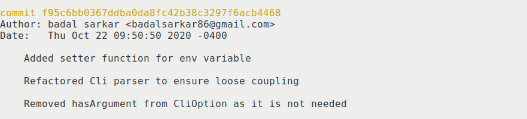
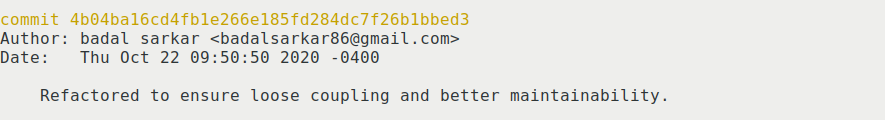

This blog is about refactoring the codes of Blink and usage of some Git commands
which helps to manipulate already committed codes, more specifically `git
rebase` and `git commit --amend`.

#### Refactoring

My goal is to refactor the codes so that it becomes more maintainable.
Currently, the code base of Blink is organized into following modules-

- `App.java` : Entry point of the application
- `Environment.java`: Responsible for maintaining environmental variables
- `CliParser.java`: Responsible for constructing command line argument and
parsing arguments
- `FileParser.java`: Responsible for parsing files
- `Checker.java`: Responsible for checking URLs
- `Writer.java`: Provides functionality to write to file
- `HttpStatusToText.java`: Maps HTTP status code to descriptive text e.g. `200`
maps to `GOOD`.
- `PrintColor.java`: Stores color configuration and attach colors to HTTP codes
e.g. `200` has color `green`.
- `UrlStatus.java`: Stores information about an URL.
- `UrlPrinter.java`: Stores configuration for printing an URL to screen.

Each of the classes has a specific responsibility and the classes are small.
However, I noticed  there is a bug in the `extractAllVariables()` function.

```java
// extracts all variables
  public static void extractAllVariables() {
    cliColor = Integer.parseInt(System.getenv("CLICOLOR"))==1?true:false;
  }
```
There can be `NullPointerException` if the `CLICOLOR` environmental variable is
not set. So, I added a null pointer check.

**Loose coupling of `CliParser`**

I implemented `CliParser` using [Apache Commons
CLI](http://commons.apache.org/proper/commons-cli/). My `App` class was
interacting directly with the implementation. I think this is bad. For any
reason, if I need to change the implementation of my cli parser, I also need to
make change to my `App` class. My `App` should rather interact with an interface
so that it doesn't need to know anything about the implementation of cli parser.
For this, I created an interface `CliParser` which provides some methods that
will be used by the application. 

```java
  public interface CliParser {
      void registerCliOption(CliOption option);
      void defineCliOptionWithArgument(CliOption option);
      void defineCliGroupOption(CliOption... options);
      void parse(String[] args);
      boolean isCliOptionSet(CliOption option);
      String getCliOptionArgValue(CliOption option);
      void printHelp();
  }
```

I created `CliParserImpl`
[class](https://github.com/badalsarkar/Blink/blob/master/src/main/java/com/badalsarkar/CliParserImpl.java)
which implements the interface using the [Apache Commons
CLI](http://commons.apache.org/proper/commons-cli/). Now, if I need to
change my implementation for example if I want use different library, I can
easily do that. The implementation must implement the interface and my
application is interacting with the interface. This is more maintainable.

**Removing dead code**

In some of my classes, there were some unused codes. I removed those to clean
things up.

#### Working with Git History

All my refactoring work was done in a feature branch called `refactoring`. I
made total 3 commits. But at the end all those commits were for the same
purpose- to refactor codes. So, instead of having 3 different commits, I have
put them together in a single commit. This keeps git history nice and clean. To
combine multiple commits into one, we can use `git rebase --interactive`
[command](https://git-scm.com/book/en/v2/Git-Tools-Rewriting-History). After
combining my commits looks like below-



The commit shows all three commit messages from three commits. We can further
clean it up by just putting one commit message in stead of three. `git commit
--amend` is the
[command](https://git-scm.com/book/en/v2/Git-Tools-Rewriting-History) for this.
This lets us edit the commit message. After modification my commit looks like
below-



Next, I merged the `refactoring` branch to the `master` branch and pushed it to
the remote server.


