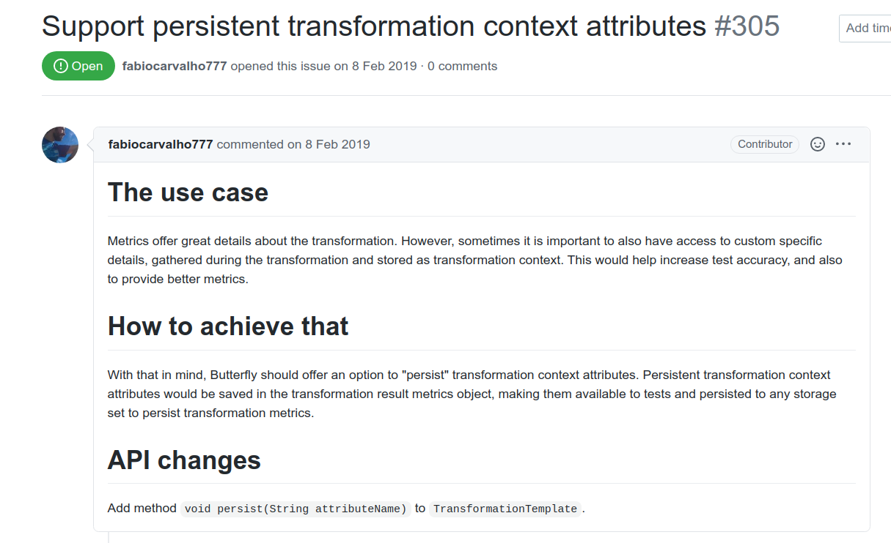

[Release
0.4](https://github.com/Seneca-CDOT/topics-in-open-source-2020/wiki/release-0.4)
requirements has been released. As part of OSD600 curriculum I have worked on
release
[0.1](https://github.com/Seneca-CDOT/topics-in-open-source-2020/wiki/release-0.1),
[0.2](https://github.com/Seneca-CDOT/topics-in-open-source-2020/wiki/release-0.2)
and
[0.3](https://github.com/Seneca-CDOT/topics-in-open-source-2020/wiki/release-0.3)
during last three months. Each release made us work on open source projects. I
started release 0.1 without any knowledge of working in open source project. In
release 0.3, I have implemented a logging framework replacing existing framework
in PayPal/Butterfly project. I feel good about my progress.

Release 0.4 requires us to work on bigger issues in open source project- may be
to implement a new feature or fix a bug. I have three repositories in my mind
for this release- [PayPal/Butterfly](https://github.com/paypal/butterfly),
[Questdb](https://github.com/questdb/questdb) and
[FinancePY](https://github.com/domokane/FinancePy). Questdb and FinancePY is
complete new to me. So, I think it will take sometime to understand the
code base. On the other hand, I have already worked with Butterfly and I know
the code base well enough to work on bigger issues. Therefore, I will work in
Butterfly.

> Butterfly is an application code transformation tool, and commonly it is used
> to perform automated application migrations, upgrades and source code and
> configuration changes.

I was going through the [issues labeled as
enhancement](https://github.com/paypal/butterfly/issues?q=is%3Aopen+is%3Aissue+label%3Aenhancement)
and found many of them interesting. There were three issues which were related
to the logging functionality of the application. I have just implemented a new
logging framework. This is yet to be merged as the maintainer was in vacation.
So, I won't be able work on these issues.

At this point, looking at the open issues were not helping me to pick one. I
decided to read more about the application on how it works. So, I headed over to
the [website](https://paypal.github.io/butterfly/). I tried the application
myself and it gave me a better understanding of the application.

Coming back to the issues, I could better understand some of the feature
requests. At the core of the butterfly there is transformation template and
extensions. Everything happens based on these. There are some issues related to
these part of the application. I am currently looking at the following feature
to see if I will start working on it.

I am going to post update on the issues I am working later this week.

