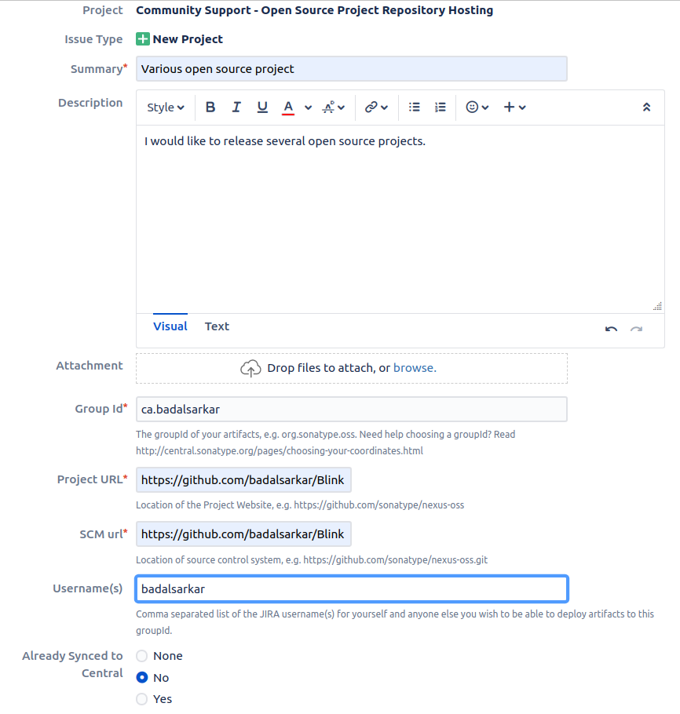
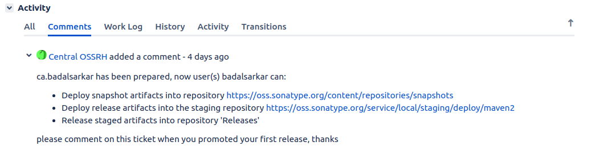
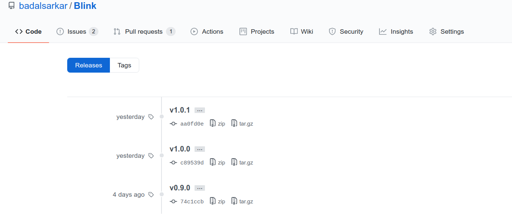
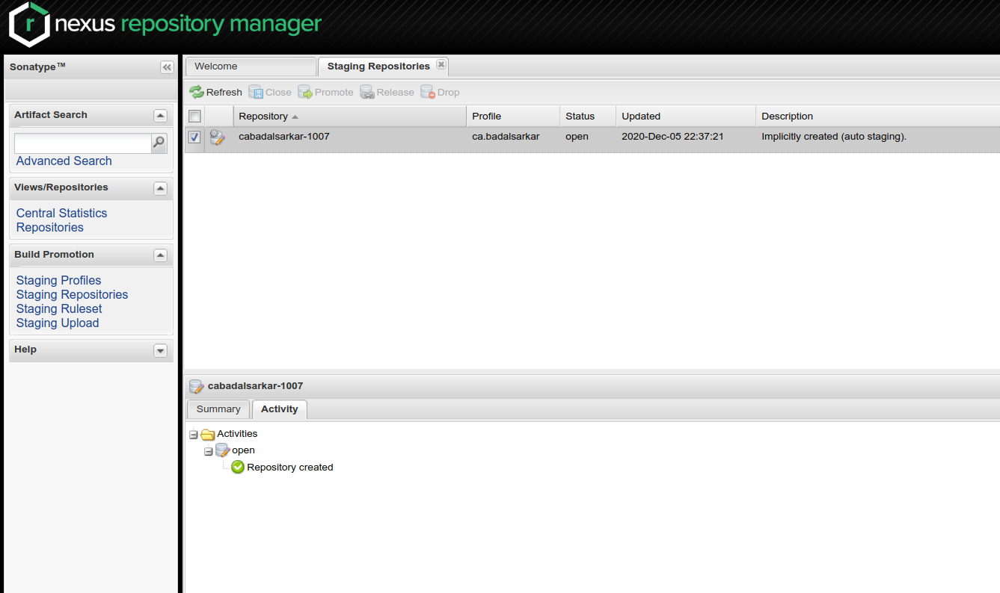
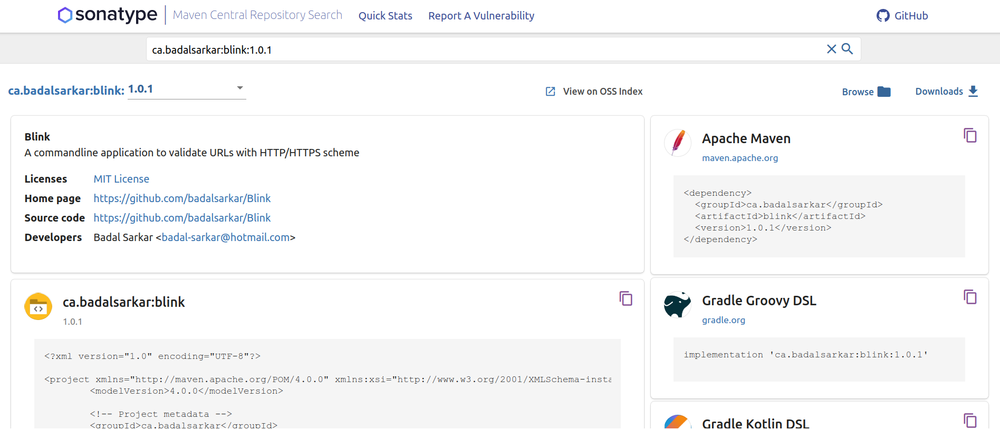

Last week I have worked on to release
[Blink](https://github.com/badalsarkar/Blink) to Maven Central repository.
Blink is now available for download
[here](https://search.maven.org/artifact/ca.badalsarkar/blink).

Setting up my project for release was fairly simple. Thanks to Maven plugins.
While it is easy to release to GitHub, there are some setups to be done to
release to Maven Central because they have some pre-requisites for publishing.
In this blog, I am going to describe the process of releasing to GitHub and
Maven Central in detail.

### Releasing to GitHub

I have used Maven Release plugin to release to GitHub and to Maven Central. This
plugin has several [goals](https://maven.apache.org/guides/introduction/introduction-to-the-lifecycle.html).
Among those I have used `release:prepare` to release to GitHub and
`release:perform` to release to Maven Central. If you don't know what these
goals are you can [read
here](https://maven.apache.org/guides/introduction/introduction-to-the-lifecycle.html).
Lets add the necessary configuration in the `pom.xml` and then we will see what
is happening in detail. I added the following in my pom file-

```xml
<scm>
  <connection>scm:git:git@github.com:badalsarkar/Blink.git</connection>
  <developerConnection>scm:git:git@github.com:badalsarkar/Blink.git</developerConnection>
  <url>https://github.com/badalsarkar/Blink</url>
  <tag>HEAD</tag>
</scm>

<plugins>
  <plugin>
    <groupId>org.apache.maven.plugins</groupId>
    <artifactId>maven-release-plugin</artifactId>
    <version>2.5.3</version>
    <configuration>
        <tagNameFormat>v@{project.version}</tagNameFormat>
    </configuration>
  </plugin>
</plugins>
```

There are two elements mainly. SCM from line 1-6 and plugin element from line
8-17.

1. [SCM(Source Control Management)](http://maven.apache.org/pom.html#SCM) contains
the information about the source control
system. Here I am providing my project's GitHub link under `connection` and
`developerConnection` element. `Connection` is used for read access and
`developerConnection` is used for write access to the repository. `Url` element
contains the link to my repository and `tag` element specifies the tag that this
project lives under.

*Note: If you want to use other version control system apart from Git, check
[here](http://maven.apache.org/scm/scms-overview.html)*

2. `Plugin` element contains maven-release-plugin related properties. Line 14
specifies the format to be used for tag name. For my case it will be `v1.0.0`.

Now that the plugin is setup, if I run the command `mvn release:prepare`, my
project will be released to GitHub. The following activities will be performed
as part of this process. Understanding the process under the hood helps a lot to
deal with any issues.

This goal executes the following tasks-

- Checks that there are no uncomitted changes in the code base. If there are
uncomitted changes, the process will be aborted.
- Checks that there are no SNAPSHOT dependencies.
- Change the version number in the `pom.xml` file. When you
execute this goal, you will be asked for version number. For example, my
current version is 1.0.0-SNAPSHOT. After this goal is executed, the version
will be 1.0.0 which I provided.
- Transform SCM(Source Control Management) information in the `pom.xml` to
include the final destination of the tag.
- At this point the `pom.xml` has been modified so all the tests will be run
with this modified pom to make sure everything is working.
- Commit the modified pom.
- Create the tag in GitHub with the version number information.
- Increase the version number for next development work. In my case it will be
1.0.1-SNAPSHOT. This is done in `pom.xml` file.
- Commit the modified pom file.

### Releasing to Maven Central

Maven release plugin the goal `release:perform` which releases the project from
SCM (GitHub in my case) to remote repository set up in the pom file. For this
first I need to configure Maven Central as remote repository. I need to do the
following steps-

1. Create Jira account
2. Create a ticket for new project
3. Update pom.xml to fulfill release requirements
4. Provide distribution management and authentication data
5. Create `settings.xml`


#### Create Jira account

You need to create a Jira accouont to create a ticket to request access for
releasing to Central repository. Go to
[https://issues.sonatype.org/secure/Signup!default.jspa](https://issues.sonatype.org/secure/Signup!default.jspa)
and open your account.

#### Create ticket for new project

I created Jira ticket with following information. This ticket is used to get
access for releasing.



When you are choosing group id, you need to consider a few things.  Group id is
written in reverse order of any domain name. For example domain example.com will
be written as com.example. The group id will be verified as part of access
process. So, you should use a domain that you own or you can use GitHub domain
name. If you use GitHub as group id write is as `io.github.yourusername`. This
is the fastest way to get access as this group id will be verified immediately.
If you use any other domains, do any of the following to verify the ownership of
the domain-

- create a TXT record in your DNS referencing your OSSRH ticket number and your
groupId will be approved. This is the fastest way.
- Setup a redirect from your domain to the GitHub URL where you are hosting your
project.

Once the ticket is submitted, it will be processed and once it is approved, it
will show following status-



The status shows two urls. One is for SNAPSHOT artifacts and one is for final
release artifacts. Once I release my project, it will be available there.

#### Update Pom to fulfill release requirements

The pom.xml file must contain following information

- Correct co-ordinate
- Project name, description and URL
- License information
- Developer information
- SCM information
- Provide Javadoc and Sources
- Sign files with GPG/PGP

My pom file content for each of these are given below-

```xml
<!-- Project co-ordinate -->
<groupId>ca.badalsarkar</groupId>
<artifactId>blink</artifactId>
<version>1.0.0-SNAPSHOT</version>

<!-- Project name, description, url -->
<name>Blink</name>
<description>A commandline application to validate URLs with HTTP/HTTPS scheme</description>
<url>https://github.com/badalsarkar/Blink</url>

<!-- Opensource license -->
<licenses>
  <license>
    <name>MIT License</name>
    <url>http://www.opensource.org/licenses/mit-license.php</url>
  </license>
</licenses>

<!-- Developer information -->
<developers>
  <developer>
    <name>Badal Sarkar</name>
    <email>badal-sarkar@hotmail.com</email>
  </developer>
</developers>

<!-- Version control infomation -->
<scm>
  <connection>scm:git:git@github.com:badalsarkar/Blink.git</connection>
  <developerConnection>scm:git:git@github.com:badalsarkar/Blink.git</developerConnection>
  <url>https://github.com/badalsarkar/Blink</url>
  <tag>HEAD</tag>
</scm>
```

To provide Javadoc and Source files I used the following plugins-

```xml
<!-- Maven source plugin to add source file to the release jar -->
<plugin>
  <groupId>org.apache.maven.plugins</groupId>
  <artifactId>maven-source-plugin</artifactId>
  <version>2.2.1</version>
  <executions>
    <execution>
      <id>attach-sources</id>
      <goals>
        <goal>jar-no-fork</goal>
      </goals>
  </execution>
  </executions>
</plugin>


<!-- Maven javadoc plugin to add javadoc to the published jar at Maven 
    central -->
<!-- https://central.sonatype.org/pages/apache-maven.html -->
<plugin>
  <groupId>org.apache.maven.plugins</groupId>
  <artifactId>maven-javadoc-plugin</artifactId>
  <version>3.2.0</version>
  <executions>
    <execution>
      <id>attach-javadocs</id>
      <goals>
        <goal>jar</goal>
      </goals>
    </execution>
  </executions>
</plugin>
```

I used the following plugin to sign files with PGP-

```xml
<!-- The Maven GPG plugin is used to sign the components with the following 
				configuration. -->
<!-- https://central.sonatype.org/pages/apache-maven.html -->
<plugin>
  <groupId>org.apache.maven.plugins</groupId>
  <artifactId>maven-gpg-plugin</artifactId>
  <version>1.5</version>
  <executions>
    <execution>
      <id>sign-artifacts</id>
      <phase>verify</phase>
      <goals>
        <goal>sign</goal>
      </goals>
    </execution>
  </executions>
</plugin>
```

For this plugin to work, you need to generate keys using PGP. Read the guide
from
[https://central.sonatype.org/pages/working-with-pgp-signatures.html](https://central.sonatype.org/pages/working-with-pgp-signatures.html)
to do this.

#### Provide distribution management and authentication data

Now we need to provide details of our remote repository. This is done using the
following element in `pom.xml`-

```xml
<!-- Remote repository to deploy the project -->
<distributionManagement>
  <snapshotRepository>
    <id>ossrh</id>
    <url>https://oss.sonatype.org/content/repositories/snapshots</url>
  </snapshotRepository>
  <repository>
    <id>ossrh</id>
    <url>https://oss.sonatype.org/service/local/staging/deploy/maven2/</url>
  </repository>
</distributionManagement>
```

#### Create Settings.xml

We are almost done. Our `distributionManagement` element and plugin to sign
files with PGP requires some credentials. These are not stored in pom.xml. They
are stored in `settings.xml` files located in ~/.m2/settings.xml. If you don't
have this file, you can create one. I added the following content-

```xml
<settings>
  <profiles>
    <profile>
      <id>ossrh</id>
      <activation>
        <activeByDefault>true</activeByDefault>
      </activation>
      <properties>
        <gpg.executable>gpg</gpg.executable>
        <gpg.passphrase>
          The passphrase you used when creating GPG
        </gpg.passphrase>
      </properties>
    </profile>
</profiles>
  <servers>
    <server>
      <id>ossrh</id>
      <username>
        The user name when you created Jira account
      </username>
      <password>
        Your Jira account password
      </password>
    </server>
  </servers>
</settings>
```

All done. Now it is time to release. I ran the command `mvn release:prepare` and
after the goal is finished, I have the following in my GitHub-



I have done three releases. Next I ran `mvn release:perform` to release to Maven
Central. Once the goal was finished, I logged into my account at [https://oss.sonatype.org/](https://oss.sonatype.org/).
It will look like following and the project is located in staging repositories.



I need to click the close button and wait for the process to complete. The
uploaded repository will be checked at this point to see if all the prerequisite
is fulfilled. If the process completes successfully, I can click on the release
button to release the project to Maven Central repository. If the process fails
you can check the error message and drop the repository.

Note: If you are releasing for the first time, you need to login to your Jira
account, pull up the ticket that you created for requesting access and add a
comment to that ticket mentioning that you have made your first release. Once
you do this someone will activate auto-sync to Maven Central. This is required
only for first release to Maven Central.

Now the release process is complete. It usually takes two hours before you can
find your project in Maven Central. This is how it looks for my project at
[https://search.maven.org/artifact/ca.badalsarkar/blink/1.0.1/jar](https://search.maven.org/artifact/ca.badalsarkar/blink/1.0.1/jar).



### User Testing

I requested one of my developer friend Hussain, to follow my README and use the
application. He downloaded the executable Jar file from Maven Central and
followed my README to use the application. He said that he could follow the
instructions easily. Only thing he recommended adding is the system requirement.
Blink requires Java 11 or higher. So, I added that in the README file.

### My learning

The whole process of releasing is new to my. This is my first released software.
Setting up the Maven Central release took some time. But now, I fell really good
to see my project at Maven Central.
