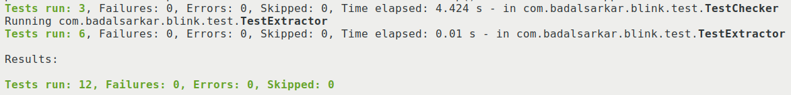
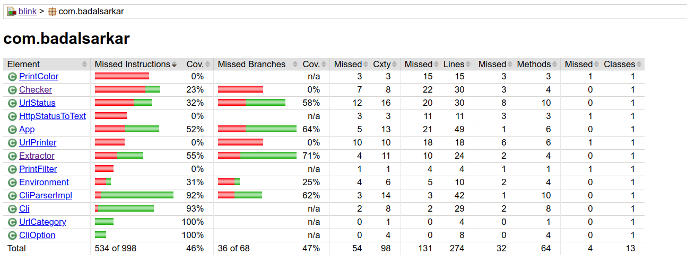
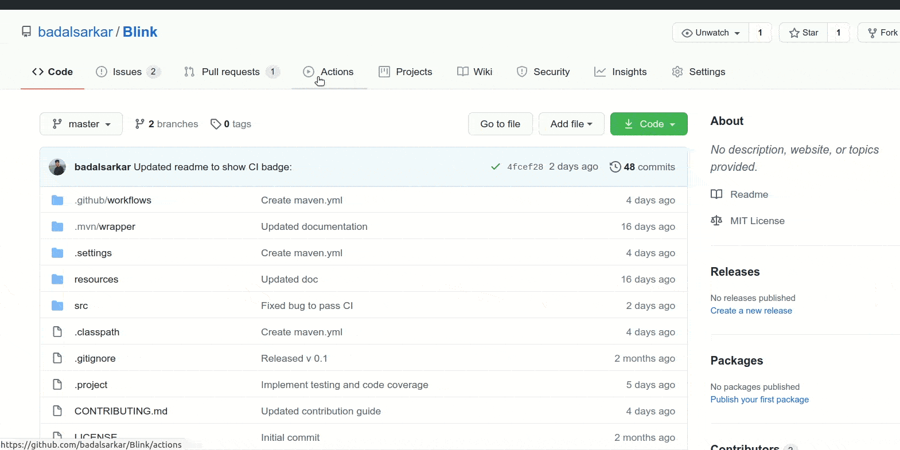
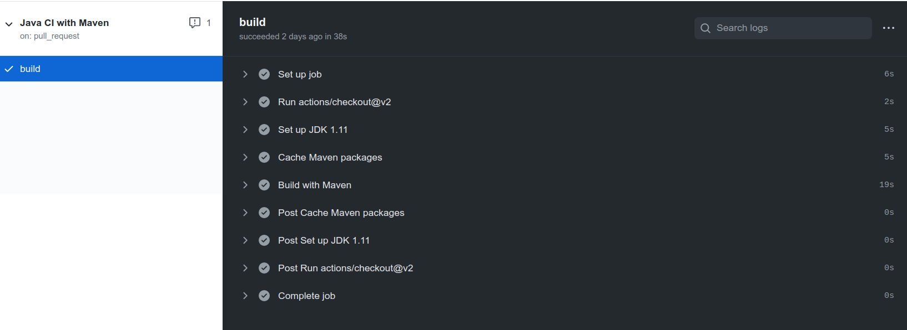

As part of [lab
8](https://github.com/Seneca-CDOT/topics-in-open-source-2020/wiki/lab-8) of
OSD600, I have implemented automated testing using JUnit 5
and continuous integration using Github Action in
[Blink](https://github.com/badalsarkar/Blink). This blog post is about
how I implemented these tools in my project.

### Automated testing

Blink was written in Java using Maven. There are many popular testing frameworks
for Java. [JUnit](https://junit.org/junit5/) is among the most widely used.
JUnit has the 5th major version of the framework, Junit 5 . I have never worked
with JUnit so I decided to try using it this time. Setting up Junit 5 with Maven
is super simple. I added the following dependencies in my `pom.xml`

```xml
<dependencies>
  <dependency>
    <groupId>org.junit.jupiter</groupId>
    <artifactId>junit-jupiter-api</artifactId>
    <version>5.4.2</version>
    <scope>test</scope>
  </dependency>
  <dependency>
    <groupId>org.junit.jupiter</groupId>
    <artifactId>junit-jupiter-engine</artifactId>
    <version>5.4.2</version>
    <scope>test</scope>
  </dependency>
</dependencies>

```

To run the JUnit tests with Maven, I added the Maven [Surefire
plugin](https://maven.apache.org/surefire/maven-surefire-plugin/) in my
pom.xml like below-

```xml
<build>
  <plugins>
    <plugin>
      <artifactId>maven-surefire-plugin</artifactId>
      <version>2.22.1</version>
      <configuration>
          <argLine>${surefireArgLine}</argLine>
      </configuration>
    </plugin>
  </plugins>
</build>
```

Maven surefire plugin runs the unit tests with the command `mvn test`. It also
generates test reports. The tests need to reside in /src/test/ folder and the
name of the test file should be one of the following-

- Test\*.java
- \*Test.java
- \*Tests.java
- \*TestCase.java

The element `argLine` is for replacement of properties set on the command line.
In my case, this is used for
[Jacoco](https://www.jacoco.org/jacoco/trunk/index.html), a code coverage
analysis tool. I am going to set it up next.

Jacoco is a free code coverage tool for Java. It generates a report showing how
many lines of code has been covered by tests. To set up Jacoco with Maven I
added the following dependency which I found in
[this](https://www.petrikainulainen.net/programming/maven/creating-code-coverage-reports-for-unit-and-integration-tests-with-the-jacoco-maven-plugin/)
blog-

```xml
<plugin>
  <groupId>org.jacoco</groupId>
  <artifactId>jacoco-maven-plugin</artifactId>
  <version>0.8.4 </version>
  <executions>
    <!-- Prepares the property pointing to the JaCoCo runtime agent which 
    is passed as VM argument when Maven the Surefire plugin is executed. -->
    <execution>
      <id>pre-unit-test</id>
      <goals>
        <goal>prepare-agent</goal>
      </goals>
      <configuration>
        <!-- Sets the path to the file which contains the execution data. -->
        <destFile>${project.build.directory}/coverage-reports/jacoco-ut.exec</destFile>
        <!-- Sets the name of the property containing the settings for JaCoCo 
              runtime agent. -->
        <propertyName>surefireArgLine</propertyName>
      </configuration>
    </execution>
      <!-- Ensures that the code coverage report for unit tests is created 
      after unit tests have been run. -->
      <execution>
        <id>post-unit-test</id>
        <phase>test</phase>
        <goals>
          <goal>report</goal>
        </goals>
        <configuration>
          <!-- Sets the path to the file which contains the execution data. -->
          <dataFile>${project.build.directory}/coverage-reports/jacoco-ut.exec</dataFile>
              <!-- Sets the output directory for the code coverage report. -->
          <outputDirectory>${project.reporting.outputDirectory}/jacoco-ut</outputDirectory>
        </configuration>
      </execution>
  </executions>
	</plugin>
```

In the above configuration there are two executions. Lets see what those means.

First execution [line 8-20]
sets up Jacoco
[prepare-agent](https://www.eclemma.org/jacoco/trunk/doc/prepare-agent-mojo.html)
goal. In Maven a goal is a way to define some actions. The `prepare-agent` goal
creates a property which point to the Jacoco runtime agent. This agent is
responsible for interacting with application under test and create execution
data needed to generate the final report. We are defining the output folder for
execution data at line 15 and the property name is defined at line 18. Note that
this is the property I set in my Surefire configuration at line 7. This is how
Jacoco interact with Surefire which runs our tests.

Second execution [line 23-35] defines the `report` goal. This goal generates the
actual test coverage report. We are specifying that this goal will run at the
`test` phase at line 25. Read more about Maven build lifecycle [here](https://maven.apache.org/guides/introduction/introduction-to-the-lifecycle.html).
Next I am specifying the directory to find the test execution data at `dataFile`
element and the directory to save the final report at `outputDirectory` element.

That's all for setting automated tests. When I run `mvn test`, all my tests will
run and I will get a test coverage report in the specified directory. I will
show you below how this looks like.

#### Writing test cases

I have a function that extracts all URLs starting with HTTP/HTTPS from some
texts. The function looks like below-

```java
public static List<String> extractUrlFromText(String text, Pattern pattern) {
    List<String> url = new ArrayList<String>();
    if (argsAreInvalid(text, pattern)) {
      return url;
    }
    int startPos = 0;
    int endPos = 0;
    Matcher matcher = pattern.matcher(text);
    while (matcher.find()) {
      startPos = matcher.start();
      endPos = matcher.end();
      url.add(text.substring(startPos, endPos));
    }
    return url;
  }
```

I have written several test cases for this function. One of them is following-

```java
public class TestExtractor {

  @Test
  @DisplayName("Text contains two URLs, Extractor returns List of two URLs")
  void extractTwoUrls() {
    String text = "http://github.com https://github.com/badalsarkar/Blink";
    Pattern pattern =
        Pattern.compile("(http|https):\\/\\/[-a-zA-Z0-9+&@#/%?=~_|!:,.;]*[-a-zA-Z0-9+&@#/%=~_|]");

    List<String> actualResult = Extractor.extractUrlFromText(text, pattern);

    List<String> expectedResult = new ArrayList<String>(2);
    expectedResult.add("http://github.com");
    expectedResult.add("https://github.com/badalsarkar/Blink");

    Assertions.assertEquals(expectedResult, actualResult);
  }
}
```

I have named my test class as `Test+[actual class name]`. So, this class will be
picked up by Surefire plugin. Next I have annotated the method with `@Test`.
This annotation marks a method as a test. The annotation `@DisplayName` is used
to provide a readable name to the test. In the test report this test will show
as the `DisplayName`. If this is not specified, the method name will be used in
the report. However, Surefire plugin is not picking up this annotation. I have
not debugged it yet why. This is something I will look at later. Next I call the
method under test at line 10. I am defining `expectedResult` to match the
`actualResult`. Finally I am matching the expected and actual result at line 16.
This is how test cases are written in Junit 5. You can see all the test cases
[here](https://github.com/badalsarkar/Blink/tree/master/src/test/java/com/badalsarkar/blink/test).

With several test cases written, I ran the command `mvn test`. It ran all my
tests and got the following in my console-



A test coverage report is also generated. The report looks like below-



The report shows all my classes in the left column and different coverage
metrics. For example, the class `PrintColor` has not been tested at all and the
class `Checker` has 23% test coverage. Jacoco has following test coverage
metrics-

- Instructions (C0 coverage): Signifies how many byte code instructions have
  been covered.
- Branches (C1 coverage): For `if` and `switch` statement, whether all possible
                          branches have been tested or not.
- Cyclomatic complexity: It shows how many tests needed to fully cover a class.
- Lines: It tells how many lines have been tested.
- Methods: Signifies how many methods have been tested.
- Class: Signifies how many classes have been tested.

You can read more about these metrics [here](https://www.jacoco.org/jacoco/trunk/doc/counters.html).

#### Testing network request

I have the following method that makes network request to the given `url` and
returns an object that stores `url` and the status of request.

```java
public static UrlStatus makeRequest(String url) {
    UrlStatus status = null;
    try {
      HttpURLConnection connection = (HttpURLConnection) new URL(url).openConnection();
      connection.setInstanceFollowRedirects(true);
      connection.setRequestMethod("HEAD");
      connection.setConnectTimeout(5000);
      status = new UrlStatus(url, connection.getResponseCode());
    } catch (IOException ex) {
      return new UrlStatus(url, 1);
    }
    return status;
  }
```

For testing this method, I can write tests that will make actual network request
and validate if this method is working as expected. But there is a problem in
this approach. My test becomes dependent of external resource which is not under
my control. For example, if there is no internet connection my test will fail.
If the server is down, my test will fail. Also, network requests are slow. But
unit tests should be fast. So, the solution is to use a mock network request.
A mock network request acts as an actual request but it doesn't go over the
network.

There are many approaches to achieve this. There are many frameworks that can
create mock object for test purpose. As my method is using `URL` and
`HttpURLConnection` class, I need to create mock object of these classes. Once I
create mock object, I can configure them to return fake network response. I
tried to use [Mockito](https://site.mockito.org/) and
[PowerMock](https://github.com/powermock/powermock) with JUnit 5. But with
JUnit 5, neither Mockito nor PowerMock can create mock object of `URL` class. It
was possible for Junit4 with older version of Mockito and PowerMock. Another way
to do this testing is to use mock server. That's the route I took.

I have used [API Simulator](https://apisimulator.io/) to configure a mock server with custom HTTP status
code. So, when my code is making network request, it was going to this server
which is running on localhost. The mock server is returning the pre-configured
status code which my method uses to create the object. Lets see how I configured
this mock server-

**Adding dependency**

I added the following to my `pom.xml` file.

```xml
<dependencies>
  <dependency>
    <groupId>com.apisimulator</groupId>
    <artifactId>apisimulator-http-embedded</artifactId>
    <version>1.7</version>
  </dependency>
</dependencies>
```

**Configuring the mock server**

`gist:badalsarkar/596211e7691ebf6f6792231ef65fa606#MockNetworkTest.java?lines=1-16,35-42`

The configuration above is really simple. First I instantiate a mock server at
line 7. From line 9 - 16, I am adding a mock request and response to the server.
So, when the server receives a request in the form
`https://www.google.com/return/200` it will return a status code of `200`. Note,
that I have annotated my method with `@BeforeAll` annotation. This means that
this method will be executed before running any of the test cases within this
class. At the same time I have used `@AfterAll` annotation to stop the server.
`@AfterAll` annotated method will be executed after all tests within the class
are run.

Next, I have used this mock server in the following lines of code.

`gist:badalsarkar/596211e7691ebf6f6792231ef65fa606#MockNetworkTest.java?lines=44-56`

First, I have used `system.setProperty()` to set the proxy host and proxy port.
Now, any network request will go to `localhost` running at port `6090`. This is
where my mock server is running. When the mock server receives a request, it
will match the request with the one I have specified before and return the
response associated with it. After that I do my assertion I am
resetting the `http.proxyHost` and `http.proxyPort` so that from that point on
network requests are made directly.

Alright, that's all with mocking network requests. Next stop is the world of
Continuous Integration.

### Continuous Integration with GitHub Actions

All these testing are good for local use only. I write code, run tests and if
all tests pass I push the code to my `main` branch. But what if I forget to run
the tests? Buggy code can creep into my `main` branch. Oh! I have a solution for
that. I have a script that will run when any code is committed. I talked about
that script and some other useful stuff [here](https://badalsarkar.ca/blog-opensource/opensource/Blink-gets-static-analysis-tools/).
The script runs all the tests when any commit is about to happen and if any
tests fail, the commit is aborted. Great. But there is a command `git commit
--no-verify` which allow the commit to go through without running the script. So
how do I solve this? The answer is with Continuous Integration.

Continuous Integration(CI) means automating the build and testing of code when
someone want to add code to the project. There are many CI tools like GitHub
Actions, TravisCI, CircleCI, TeamCity etc. I have used GitHub Actions for my
project. I have set it up such that when any code is pushed to my `main` branch
or when a pull request is created against the `main` branch, all my tests will
be run, linter will check for bugs and code formatter will ensure that codes are
formatted correctly. If any of these fails, the code changes will be rejected.

Lets see how I configured this.



<br>
I have used templates already provided by GitHub Actions. I used maven template
as my project was built with maven.
Once you follow the above video, you will get a `maven.yml` in `.github/workflows`
folder. You can customize this file as per your requirement. Read [this](https://docs.github.com/en/free-pro-team@latest/actions/guides) 
to learn how to customize this script. My script looks like below-

`gist:badalsarkar/596211e7691ebf6f6792231ef65fa606#maven.yml`

- From line 6-10, I am specifying when to execute this script.
- Line 12 configures all jobs. A workflow consists of one or more jobs. I have
one job here. This job runs on `ubuntu-latest` operating system.
- Starting line 17, I am specifying the steps that this job will run.
- Line 18 means GitHub Actions will download a copy of my repository
- Line 19 to 22, sets up Java with JDK 11.
- Line 24-28, caches the project dependencies. If this is not setup every time
the workflow runs it will download all the dependencies. This will slow down the
workflow. Read more about it [here](https://docs.github.com/en/free-pro-team@latest/actions/guides/building-and-testing-java-with-maven#caching-dependencies).
- Line 29-30, I am running a maven command `mvn verify`. This maven command will
run all tests, linter and code formatting checker.

That's all there is to do with configuring GitHub Actions CI. Now, when I push
any code to my `main` branch, I get the following report from GitHub Actions-



### Contributing to a partner's repo

Lab 8 required us to contribute to a partners repo by adding tests. I
contributed to [Eunbee Kim's](https://github.com/eunbeek) project
[findBrokenGlass](https://github.com/eunbeek/findBrokenGlass). This project is
also written in Java and built with Maven. I added a test for the following
method-

```java
  // Method under test
  public static JSONObject convertJavaObjectToJson(String url, int code) {
    JSONObject obj = new JSONObject();
    obj.put("url", url);
    obj.put("status", code);

    return obj;
  }

  @Test
  void testConvertJavaObjectToJson() {
    JSONObject actualObject = ConvertJavaToJson.convertJavaObjectToJson("https://google.com", 100);
    JSONObject expectedObject = new JSONObject();
    expectedObject.put("url", "https://google.com");
    expectedObject.put("status", 100);
    assertEquals(expectedObject, actualObject);
  }

```

Once the test is passing, I pushed it to his repo. His repository also had CI
workflow set up. So when my code passed the CI tests, I created a [pull request
in his repo](https://github.com/eunbeek/findBrokenGlass/pull/20).

### My learning

This lab was very important as I have implemented unit testing and CI to my
project. Unit testing is super important as this guards against code that can
break my project. I have used Mocha and Chai for JavaScript before but not
JUnit. Going forward it will be easier for me to integrate automated testing and
CI to my future projects.


