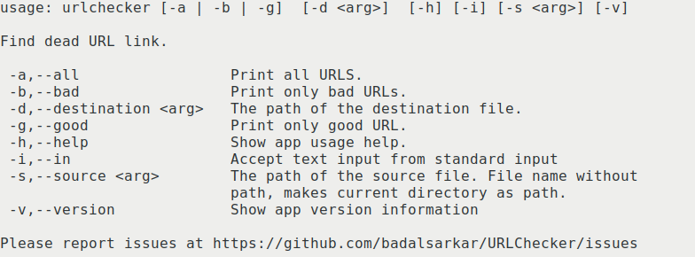
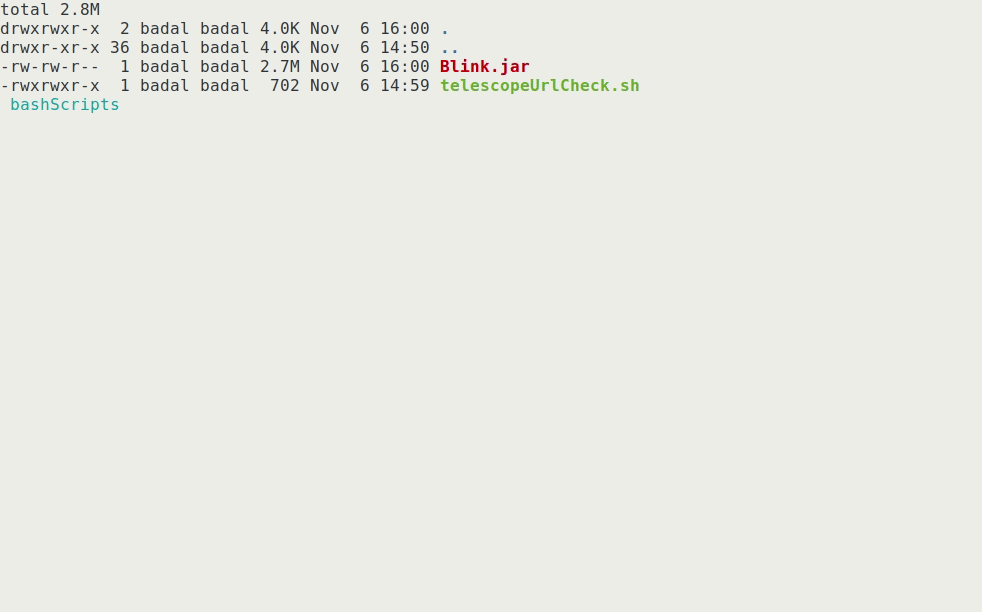

This week, I have started to work with
[Telescope](https://telescope.cdot.systems/).

>Telescope is an open source web server and client application for aggregating
>and presenting a timeline of Seneca's open source blogs. Telescope makes it
>easy to see what's happening with open source at Seneca right now.

This month and till the end of the semester, I will be working to fix bugs in Telescope
or implement new features. This is really exciting to me because Telescope uses
many technologies. By working in this project, I will be able to work with these
technologies some of which I have never worked with before.

#### The Setup

As Telescope is using many technologies, I thought setting up the development
environment would be a bit difficult. But it was not. The environment [setup](https://github.com/Seneca-CDOT/telescope/blob/master/docs/environment-setup.md)
guideline clearly describes everything that is needed to be done. I followed the
guide and everything was setup in very short time. Telescope uses [Redis](https://redis.io/) and 
[Elasticsearch](https://www.elastic.co/what-is/elasticsearch). I used [Docker](https://docs.docker.com/get-docker/)
to use those. Once everything is setup, I started Redis and Elasticsearch using
Docker and the backend server with `npm start`. Querying
http://localhost:3000/posts returned information about the 10 latest posts in
Telescope.

#### Using Blink to Check URLs in the Posts in Telescope

As part of [lab
6](https://github.com/Seneca-CDOT/topics-in-open-source-2020/wiki/lab-6), I was
required to use [Blink](https://github.com/badalsarkar/Blink) to check all URLs
mentioned in the latest 10 blog posts in Telescope. There were many ways to do
this. I decided to write a [bash
script](https://gist.github.com/badalsarkar/31bdb05c37254a052aed0049538a34e3#file-telescopeurlcheck-sh)
which will fetch latest posts from Telescope and pipe the contents of the post
to Blink.

```bash
#!/usr/bin/env bash

if ! command -v jq &> /dev/null
then
    echo "JQ is not installed."
    echo "Please install jq by sudo apt install jq."
    exit
fi

if [ ! -f ./Blink.jar ]; then
    echo "Could not find Blink. Download from https://github.com/badalsarkar/Blink"
    exit
fi

telescopeLatestPostApi=http://localhost:3000/posts
data=$(curl -s $telescopeLatestPostApi | jq '.[] | .id')
for i in $data;
do
    i="${i%\"}"
    i="${i#\"}"
    echo 
    echo ====================================================
    echo Checking $telescopeLatestPostApi/$i
    echo ====================================================
    echo 
    curl -s $telescopeLatestPostApi/$i | java -jar ./Blink.jar -i
done
```

I needed to implement a new feature in Blink, which allows Blink to accept input
from standard input for processing. This was accomplished with very minimal
changes. I added a new CLI option `-i`.



The following function is the handler function for `-i` option-

```java
if(Cli.isSet(Cli.in)) {
  configureUrlPrinter();
  try(BufferedReader reader = new BufferedReader(new InputStreamReader(System.in))){
    while(true) {
      String text = null;
      if((text = reader.readLine())!= null) {
        Checker.check(Extractor.extractUrlFromText(text, Pattern.compile(pattern)), urlPrinter);
      }
      else {
        break;
      }
    }
  }
  System.exit(0);
}
```

It basically reads from standard input and use
[`Extractor`](https://github.com/badalsarkar/Blink/blob/master/src/main/java/com/badalsarkar/Extractor.java)
and [`Checker`](https://github.com/badalsarkar/Blink/blob/master/src/main/java/com/badalsarkar/Checker.java) class
to do the necessary processing. I have added a new class-
[`Extractor`](https://github.com/badalsarkar/Blink/blob/master/src/main/java/com/badalsarkar/Extractor.java)
but this
is existing code. I want to refactor some of the things in Blink. The
[`Extractor`](https://github.com/badalsarkar/Blink/blob/master/src/main/java/com/badalsarkar/Extractor.java) class will
replace
[`FileParser`](https://github.com/badalsarkar/Blink/blob/master/src/main/java/com/badalsarkar/FileParser.java)
class.

That was it.

#### The End Result

Running the [bash script](https://gist.github.com/badalsarkar/31bdb05c37254a052aed0049538a34e3#file-telescopeurlcheck-sh)
produces the following output.




